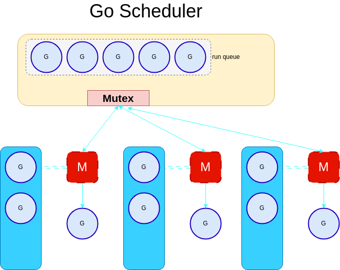
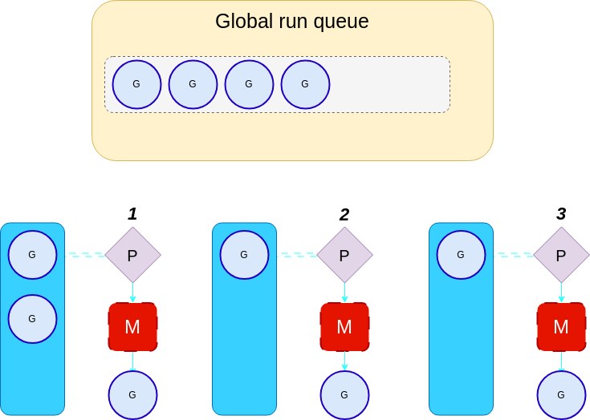
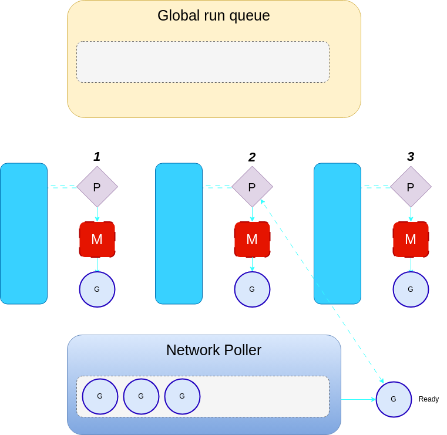
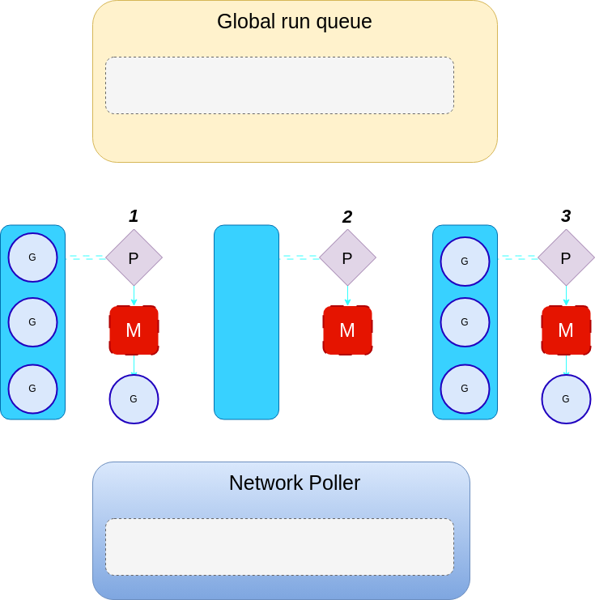
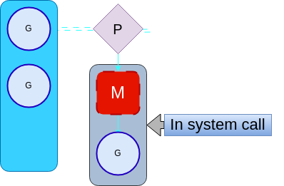
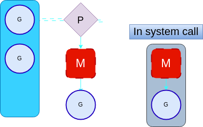

# Go runtime scheduler

Cut a long story short: go sheduler is ***`M:N:P preemptive fair`*** scheduler. Interesting? Let's dig deeper!

## The M:N Scheduler

***The M:N scheduler is a scheduler that maps N goroutines to M kernel threads***. The M:N scheduler is implemented in the Go runtime, and it is responsible for scheduling the goroutines to the kernel threads. This type of scheduler is flexible and allows the existence of more goroutines than kernel threads.

```mermaid
---
title: M:N scheduler diagram (simplified)
---
flowchart TD
    goro1((goroutine 1)) & goro2((goroutine 2)) & goro3((goroutine 3)) & goro4((goroutine 4)) & goro5((goroutine 5)) & goroN((goroutine N))
    ==> id5{{Go runtime scheduler}} -.-
    thread1((thread)) & thread2((thread)) & thread3((thread)) & thread4((thread))
```

A goroutine can be in one of the following **states**:
- **Runnable** - when it is ready to be executed and waiting for the kernel thread to execute it. A goroutine can be in a runnable state when it is created or after it has been unblocked.
- **Running** - when it is being executed by a kernel thread.
- **Blocked** - when it is waiting for an event to happen. This can be a channel operation, a system call, or a mutex.

The scheduler keeps track of the goroutines in a run queue. The run queue is a queue of goroutines that are ready to be executed. The scheduler is responsible for adding goroutines to the run queue and removing them from the run queue. The run queue follows the FIFO (First In First Out) principle.

Since there are multiple kernel threads accessing the same run queue, the access to the run queue should be synchronized.

> NOTE: this is how scheduler was implemented in Go 1.0

This synchronisation is done by using a **mutex**. A mutex is a lock that is used to synchronize access to a shared resource. In this case, the shared resource is the run queue. The scheduler uses a mutex to make sure that only one kernel thread can access the run queue at a time.

*But this approach has some negative consequences*...

### Fairness

In the context of the scheduler, **fairness** is the ability of the scheduler to give each goroutine a fair chance to be executed. The scheduler should not give more time to goroutines that are more active than others. This is because it will lead to starvation of less active goroutines.

Think of a program that has a goroutine that is constantly reading from a channel. This goroutine will be constantly active and will be constantly added to the run queue. This will lead to the starvation of other goroutines that are less active.

```go
package main

import (
    "sync"
)

func main() {
    w := sync.WaitGroup{}
    w.Add(2)
    go func() {
        defer w.Done()
        for {
            fmt.Println("Hello")
        }
    }()
    go func() {
        defer w.Done()
        for {
            fmt.Println("World")
        }
    }()
    w.Wait()
}
```

If the above program was run in a runtime that does not have fairness (like in go <= v1.0), the goroutine that prints `Hello` will be constantly added to the run queue. This will lead to starvation of the goroutine that prints World.

### Preemption

Another important concept in the scheduler is preemption. Preemption is the ability of the scheduler to preempt (stop) a goroutine that is currently running and execute another goroutine. This is done to make sure that goroutines that are time-blocking goroutines don't consume a lot of time and give a chance to other goroutines to be executed.

The scheduler uses a time slice to determine when to preempt a goroutine. The time slice is 10ms. This means that if a goroutine is running for more than 10ms, the scheduler will preempt it and execute another goroutine. The 10ms is a soft limit because of the performance heap caused by the strict enforcement of the time.

A preempted goroutine will be added to the end of the global run queue which is a FIFO queue. This means that the goroutine will be executed after all the other goroutines in the global run queue.

### Local Run Queues

There was the introduction of a new concept called local run queues. A local run queue is a run queue that is local to a kernel thread. This means that each kernel thread has its run queue. This solves the problem of fairness because each kernel thread will have its run queue and will not be affected by the other kernel threads in terms of resource sharing.

Local run queues introduced a concept called per-thread state



The local run queue has a dedicated length of 256 goroutines. If the local run queue is full, the goroutine will be added to the global run queue. The global run queue is a queue that is shared between all the kernel threads.

## M:P:N Threading Model

With the introduction of the p-thread state, if a thread is blocked in a system call, the thread does not need to maintain its local run queue. Subsequently, those goroutines will be run elsewhere.

Also if we were to implement work-stealing, to re-balance the workload, the number of threads would be unbounded.

To deal with this, the **`scheduler was changed to use an M:P:N`** threading model. 
- `M` is the number of kernel threads. 
- `N` is the number of goroutines. 
- `P` is the number of processors. The P is in charge of managing the interaction between the local run queues, the global run queue, and the kernel threads.

The number of processors is the maximum number of **GOMAXPROCS**.


This threading model is important when exploring the concepts of **work stealing** and **Handoff**.

### Work Stealing
The modern Go scheduler uses a technique called work stealing. Work stealing is a technique that is used to balance the load between the processor's kernel threads. The idea behind work stealing is that if a processor is idle, it will steal work from another processor or the global run queue, or the network poller. This is done by taking half of the work from the other processor's run queue and adding it to its run queue.

Before a processor starts stealing work, it will first check its run queue. If the run queue is not empty, it will pull a goroutine from the run queue and execute it. If the run queue is empty, it will then check the global run queue. It only checks the run queue 1/61 of the time. This is done to avoid the overhead of checking the run queue all the time. There is a tick that counts the number of times we have checked the local run queue, once it reaches 61 or a multiple of 61, we check the global run queue. This is important to avoid the starvation of goroutines in the global run queue.

It is set to 61 so that it is not too low to result in excessive checking of the global run queue, nor too high to result in starvation of goroutines in the queue. Another reason is that 61 is a prime number and prime numbers are beneficial for hashing purposes. If 64 is used, it will cause a lot of collisions. These collisions would interfere with the go runtime patterns and result in unfairness.


As you can see in the above diagram, processor 2 is idle. It will check its run queue and find that it is empty. It will then check the global run queue for goroutines.



The diagram shows that processor 2 steals 2 goroutines from the global run queue, ensuring fairness by only stealing the equivalent number of goroutines available divided by the number of processors. With 3 processors and 6 goroutines in the global run queue, each processor takes 2 goroutines.

## Network Poller
The **network poller** is another component in the go runtime that is *responsible for handling asynchronous system calls* such as *network I/O*. For instance, if a goroutine is waiting for a network request to complete, the goroutine will be added to the network poller. This is to avoid blocking the kernel thread.

If the global run queue is also empty, the processor will then have to poll the network.



If there is a runnable goroutine in the network poller (ready), the processor will add it to its local run queue.

### Cases where the global run queue, local run queue, and network poller are empty

If both the global run queue and local run queue are empty and the network poller is blocked, the processor randomly steals work from another processor, including itself. If a processor with runnable goroutines is found, half of the goroutines are taken and added to the stealing processor's run queue.



In the above diagram, processor 2 is idle. It will check all of the run queues including the network poller. It will find that all the queues are empty. It will then have to randomly pick a processor to steal work from.


Processor 2 randomly picked processor 1 to steal work from. It will steal half of the work from processor 1 and add it to its run queue. Now no processor is idle.

### Fairness Hierarchy
The go runtime uses a hierarchy of fairness to ensure that goroutines are not starved. The hierarchy is as follows:

1. Goroutine - preemption.
2. Local run queue - time slice inheritance.
3. Global run queue - check once in a while.
4. Network poller - background thread.

All these steps result in fairness at a minimal cost.

## Handoff

We have seen how goroutines end up running on the kernel threads, but what happens when a thread blocks itself? For instance, if a goroutine does a system call, it will block the kernel thread causing the other goroutines in the local run queue to be starved.



When this happens, the go runtime will call releasep to release the processor. This will disassociate the processor from the kernel thread. The processor will then be assigned a new kernel thread that is already available or a new kernel thread will be created.



This process is referred to as **handoff**.

Handoffs can be expensive, especially when we have to create a new kernel thread to associate with the processor. Also doing handoff for every syscall is not optimal as some syscalls may be shortlived and the kernel thread might not be blocked for long. To optimize this the go runtime handles the handoff in a slightly intelligent way.

- The go scheduler will do immediate handoff if it knows that the syscall will be blocking for a long time. For instance, doing a read on a socket will block the kernel thread for a long time.
- In other cases, it will let the processor be in a block. It will then set the status to reflect that it is in a syscall. Using **Sysmon** the go runtime will periodically check if the processor is still in a syscall. If it is still in a syscall, it will do a handoff.

### What happens when you return from a handed-off syscall?
When you return from a syscall the scheduler will check if the old processor (the one that was handed off) is available. If it is, the goroutine will associate itself with it. If the older processor is not available, the goroutine will associate itself with any idle processor. And if there are no idle processors, the goroutine will be added to the global run queue. Subsequently, it also parks that were in the syscall.

## Links
- [Original](https://www.kelche.co/blog/go/golang-scheduling) blog-post
- Scheduler [source code](https://github.com/golang/go/blob/master/src/runtime/proc.go)
